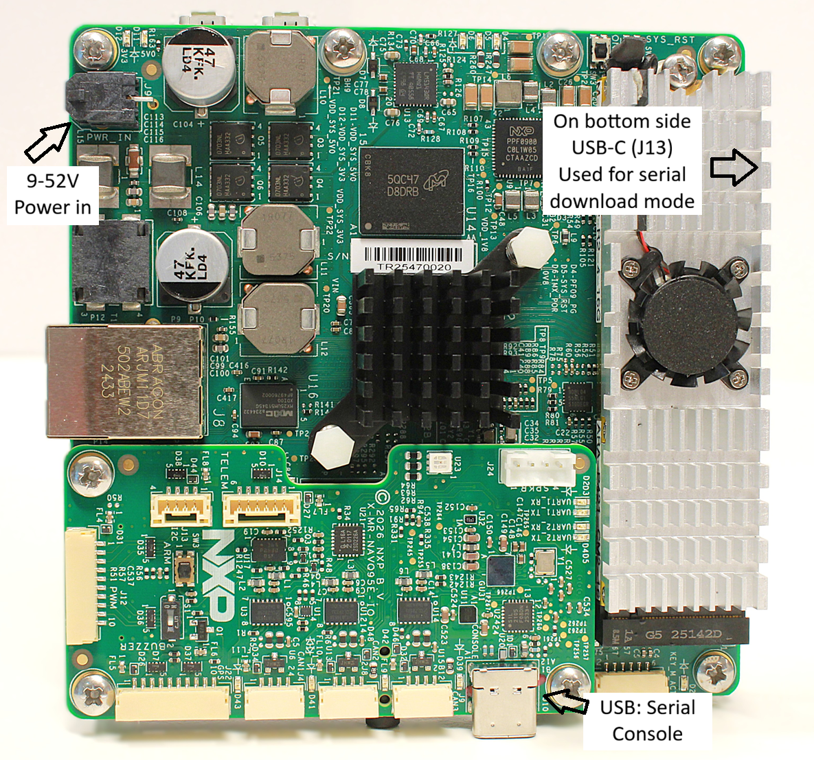

# NavQ95

The [IMX yocto project users guide](https://www.nxp.com/docs/en/user-guide/UG10164.pdf) contains
detailed explanation on how to an build SD card image for the various iMX devices. For the NavQ95 there are a few exception that need to be taken
care of.

See below table containing items that deviate from the manual:

| Item                   | Original                                    | New                                               |
| -----------------------| ------------------------------------------- | ------------------------------------------------- |
| imx-manifest repo URL  | https://github.com/nxp-imx/imx-manifest.git | https://github.com/NXP-Robotics/imx-manifest-navq95.git |
| Manifest file          | imx-6.18.20-2.0.0.xml                       | imx-6.18.20-2.0.0-navq.xml                        |
| Machine                | * (eg. imx95-19x19-lpddr5-evk)              | imx95-navqbdesktop                                |

For a NavQ95 specific explanation refer to the [Build SD card image](#build-sd-card-image) and the [Flash image to SD card](#flash-image-to-sd-card) paragraphs on this page.

<a name="build-sd-card-image"></a>

## Build SD card image

### Host prerequisites

BitBake requires unprivileged user namespaces, which AppArmor restricts by
default on Ubuntu 24.04 (noble) hosts. Enable them before building (the
setting resets on reboot):
```bash
echo 0 | sudo tee /proc/sys/kernel/apparmor_restrict_unprivileged_userns
```

Sync repositories by manifest:
```bash
mkdir imx-yocto-bsp
cd imx-yocto-bsp
repo init -u https://github.com/NXP-Robotics/imx-manifest-navq95.git -b imx-linux-wrynose -m imx-6.18.20-2.0.0-navq.xml
repo sync
```

Setup build:
```bash
MACHINE=imx95-navqbdesktop DISTRO=imx-desktop-xwayland source imx-setup-release.sh -b build-95-full
```

Optionally add below lines to conf/local.conf in case the host should stay responsive
```bash
BB_NUMBER_THREADS = "6"
PARALLEL_MAKE = "-j 5"
```

Start build:
```bash
bitbake mc:imx95-navqdesktop:imx-image-mr
```
Or to start build and immediately detach the process from the console (may be convenient since this build may take a while)
```bash
nohup bitbake mc:imx95-navqdesktop:imx-image-mr &
```

To build an image with ROS2 preinstalled:
```bash
bitbake mc:imx95-navqdesktop:imx-image-ros
```

<a name="flash-image-to-sd-card"></a>

## Flash image to SD card

To flash the yocto image to an SD card use the command below. Make sure you update the output file ```of=/dev/sdX``` to the block device that belong to the SD card.
```bash
cd /path/to/imx-yocto-bsp/build-95-full

# Deploy mc:imx95-navqdesktop:imx-image-mr on /dev/sdX
zstdcat tmp-imx95-navq/deploy/images/imx95-navq/imx-image-mr-imx95-navq.rootfs.wic.zst | sudo dd of=/dev/sdX bs=1M conv=fsync

# Deploy mc:imx95-navqdesktop:imx-image-ros on /dev/sdX
zstdcat tmp-imx95-navq/deploy/images/imx95-navq/imx-image-ros-imx95-navq.rootfs.wic.zst | sudo dd of=/dev/sdX bs=1M conv=fsync
```

<a name="flash-nor-flash-image"></a>

## Flash NOR flash image

Install pyocd to flash the image through the on-board JTAG device.
This is tested with python 3.10 but python 3.9 should suffice.

Clone pyocd into a directory of your preference and checkout the `pr-imx95` branch:
```bash
git clone https://github.com/NXP-Robotics/pyOCD -b pr-imx95
```

Build pyocd:
```bash
cd pyocd-private
python3 -m pip install .
```

Make sure the DIP switches are correctly configured as described in [Power up](#power-up-navq95).
Remove any SD card and then apply 12V to the J9 connector to power up the board.

Run below command to flash the built RTOS software to the NOR flash:
```bash
pyocd flash -t mimx95_cm33_mx25um path/to/built/file.bin -f 10m
```

> [!WARNING]
> Writing to NOR flash is not completely stable yet. Retry the pyocd flash command until pyocd displays it had only programmed 0 pages.

<a name="power-up-navq95"></a>

# Power up NavQ95

Before powerering up the NavQ95 make sure the DIP switches have the correct settings. They must be configured like the image below to boot from the SD card.


To change the boot device see table below for different boot modes

| **BOOT_MODE[3:0]** | **SW1** | **SW2** | **SW3** | **SW4** |          **Boot Device**          |
|:------------------:|---------|---------|---------|---------|:---------------------------------:|
| `1001`             | ON      | OFF     | OFF     | ON      | Serial Downloader on USB3.0 (J13) |
| `1010`             | OFF     | ON      | OFF     | ON      | Boot from eMMC                    |
| `1011`             | ON      | ON      | OFF     | ON      | Boot from SD Card                 |
| `1100`             | OFF     | OFF     | ON      | ON      | Boot from Octal Flash             |


Insert the SD card with the image installed. Then apply 9-52V to the J9 connector to power up the board.



The USB port gives access to the tty's of linux and RTOS (if flashed to the NOR flash).

The default linux user is 'user' (password: 'user')

# NavQ-B camera / display modules (DT overlays)

Two 22-pin connectors. Boot the base DTB and apply one `.dtbo` per connector:

- `csi_b2b`    — port A, CSI-only  (CSI0), camera only
- `dsicsi_b2b` — port B, CSI/DSI combo (CSI1 or DSI), camera input or display output

## Check status (U-Boot shell)

```sh
=> run modules_help          # list overlays + current selection
=> printenv csi_b2b dsicsi_b2b
```

## Swap a module

```sh
=> setenv csi_b2b    imx95-navqb-csi_b2b-imx708.dtbo
=> setenv dsicsi_b2b imx95-navqb-dsicsi_b2b-disp-7inch.dtbo
=> saveenv
=> reset
```

Use `none` to leave a connector empty.

Available `.dtbo` files live in `/boot` and are built from
`arch/arm64/boot/dts/freescale/`:

| Connector | Modules | Filename pattern |
|---|---|---|
| `csi_b2b` | `imx219`, `imx477`, `imx708`, `os08a20` | `imx95-navqb-csi_b2b-<module>.dtbo` |
| `dsicsi_b2b` | `imx219`, `imx477`, `imx708`, `os08a20`, `disp-7inch`, `disp-5inch` | `imx95-navqb-dsicsi_b2b-<module>.dtbo` |

# Flashing the eMMC on NavQ95 (Optional)

This guide explains how to flash a `.wic` image onto the NavQ95’s eMMC instead of the SD card using **UUU** (NXP’s Universal Update Utility).


## 1. Set the Board to **Serial Downloader Mode**

1. Configure the boot switches to **Serial Downloader on USB3.0 (J13)**.
2. Connect a USB‑C cable from your host PC to **J13**.
3. Power on the NavQ95.

## 2. Install **UUU**

Download and install UUU from the official repository:

- https://github.com/nxp-imx/mfgtools

> [!NOTE]
> Use uuu release 1.5.243 or newer. Older releases, including the version
> packaged in Ubuntu 24.04, cannot parse i.MX95 boot containers and fail at
> the SDPV stage with "Unknown Image type, can't use skipspl". If a transfer
> aborts with LIBUSB_ERROR_NO_DEVICE, stop ModemManager before retrying:
> `sudo systemctl stop ModemManager`


## 3. Load the SPL Bootloader

Load the temporary SPL loader so UUU can communicate with the board

> [!NOTE]
> The SPL image required for flashing the NavQ95 is included in this repo as **`MR-NAVQ95B-SERIAL-DOWNLOAD.bin`**

```
 ./uuu.exe -b spl MR-NAVQ95B-SERIAL-DOWNLOAD.bin
```

## 4. Flash the `.wic` Image to eMMC

Replace the placeholder with the path to your image:

```
 ./uuu.exe -b emmc_all <patch.to.wic.file>
```

## 5. Final Steps

1. Power off the NavQ95.
2. Set the boot switches to Boot from eMMC.
3. Power on the board, it should now boot from the new eMMC image.
